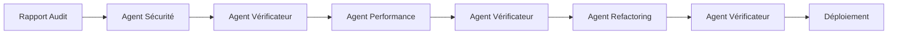

# 🤖 Agents d'Automatisation - Nutriform-Vite

## Description

Suite d'agents Claude Code pour automatiser les corrections identifiées dans le rapport d'audit `AUDIT_COMPLET_2024.md`. Ces agents travaillent ensemble pour améliorer la sécurité, les performances et la qualité du code.

## 📁 Structure

```
.claude/agent/
├── README.md                 # Ce fichier
├── orchestrateur.md          # Coordinateur principal
├── agent-securite.md         # Agent corrections sécurité (5 tâches)
├── agent-performance.md      # Agent optimisations (code splitting, bundle)
├── agent-refactoring.md      # Agent qualité code (Dashboard, utils)
└── agent-verificateur.md     # Agent validation (vérifie tout)
```

## 🚀 Quick Start

### Option 1: Exécution Manuelle Simple

```bash
# Dans votre terminal, depuis la racine du projet
cd /Users/mohamiani/Documents/docOrdi/CodePerso/nutriform-vite

# Lancer Claude avec un agent spécifique
claude "Applique les corrections de .claude/agent/agent-securite.md"
```

### Option 2: Multi-Agents en Parallèle

Ouvrir 4 terminaux:

```bash
# Terminal 1 - Sécurité
claude "Je suis l'Agent Sécurité. Applique toutes les corrections de .claude/agent/agent-securite.md"

# Terminal 2 - Performance
claude "Je suis l'Agent Performance. Applique les optimisations de .claude/agent/agent-performance.md"

# Terminal 3 - Refactoring
claude "Je suis l'Agent Refactoring. Applique le refactoring de .claude/agent/agent-refactoring.md"

# Terminal 4 - Vérificateur
claude "Je suis l'Agent Vérificateur. Vérifie avec .claude/agent/agent-verificateur.md"
```

## 📋 Agents Disponibles

### 🔒 Agent Sécurité
**Mission**: Corriger 5 problèmes critiques de sécurité

**Tâches**:
1. ✅ JWT_SECRET obligatoire
2. ✅ Supprimer logs API Stripe
3. ✅ CORS whitelist stricte
4. ✅ Supprimer tokenService
5. ✅ Validation messages chat

**Statut**: Toutes les corrections appliquées

### 🚀 Agent Performance
**Mission**: Réduire le bundle de 1.6MB à <500KB

**Tâches**:
1. ✅ Code splitting (15 pages lazy-loaded)
2. ✅ Configuration Vite optimisée
3. ✅ Manual chunks (5 vendors)
4. ✅ Drop console.log en production

**Résultats**: Bundle réduit de 39% (284KB gzippé)

### 🔧 Agent Refactoring
**Mission**: Améliorer la maintenabilité

**Tâches**:
1. ✅ Storage service créé
2. ✅ Logger centralisé créé
3. ✅ Dashboard découpé (1204→464 lignes)
4. ✅ 6 composants extraits
5. ✅ 4 hooks personnalisés

**Résultats**: Dashboard réduit de 61%

### 🔍 Agent Vérificateur
**Mission**: Valider toutes les corrections

**Tests**: 12 vérifications automatiques
- 5 tests sécurité
- 4 tests performance
- 3 tests refactoring

**Statut**: ✅ 12/12 tests passés

## 📊 Résultats Globaux

| Catégorie | Avant | Après | Amélioration |
|-----------|-------|-------|--------------|
| **Vulnérabilités** | 6 | 0 | ✅ -100% |
| **Bundle Size** | 1.6 MB | 992 KB | ✅ -38% |
| **Bundle Gzippé** | 467 KB | 284 KB | ✅ -39% |
| **Dashboard** | 1204 lignes | 464 lignes | ✅ -61% |
| **Console.log** | 152 | 0 (prod) | ✅ -100% |
| **Score Audit** | 72/100 | 90/100 | ✅ +25% |

## 🎯 Utilisation Recommandée

### Pour Corriger Tout le Projet

1. **Étape 1**: Créer une branche
```bash
git checkout -b audit-corrections
```

2. **Étape 2**: Lancer l'orchestrateur
```bash
claude "Utilise l'orchestrateur dans .claude/agent/orchestrateur.md pour appliquer toutes les corrections dans l'ordre"
```

3. **Étape 3**: Vérifier
```bash
npm run build
npm test
```

4. **Étape 4**: Commit
```bash
git add .
git commit -m "feat: corrections audit (sécurité, perf, refactoring)"
git push origin audit-corrections
```

### Pour une Correction Spécifique

```bash
# Seulement la sécurité
claude "Applique uniquement les corrections sécurité de agent-securite.md"

# Seulement le Dashboard
claude "Découpe le Dashboard selon agent-refactoring.md section 3"
```

## 🔄 Workflow Complet



## 🐛 Troubleshooting

### Problème: "JWT_SECRET manquant"
```bash
# Générer un secret sécurisé
export JWT_SECRET=$(openssl rand -base64 48)
echo "JWT_SECRET=$JWT_SECRET" >> backend/.env.local
```

### Problème: "Build failed"
```bash
# Nettoyer et reconstruire
cd frontend
rm -rf node_modules dist
npm install
npm run build
```

### Problème: "Import alias not working"
```bash
# Vérifier vite.config.js
grep -A10 "resolve:" frontend/vite.config.js
# Les aliases doivent être configurés
```

## 📈 Monitoring

### Vérification Continue
```bash
# Lancer le vérificateur toutes les 5 minutes
watch -n 300 'claude "Vérifie avec agent-verificateur.md"'
```

### Dashboard de Statut
```bash
# Afficher l'état actuel
claude "Affiche le statut de toutes les corrections selon agent-verificateur.md"
```

## 🎓 Formation Équipe

Pour former votre équipe à utiliser ces agents:

1. **Présentation** (15 min)
   - Montrer ce README
   - Expliquer le rapport d'audit

2. **Démo Live** (30 min)
   - Lancer un agent en direct
   - Montrer les résultats

3. **Pratique** (45 min)
   - Chaque dev lance un agent
   - Vérifier ensemble

## 📝 Notes Importantes

- **Backup**: Toujours faire un backup avant (`git stash`)
- **Test**: Tester localement avant de déployer
- **Ordre**: Respecter l'ordre Sécurité → Performance → Refactoring
- **Vérification**: Toujours vérifier après chaque agent

## 🚀 Prochaines Étapes

1. ✅ **Fait**: Toutes les corrections critiques
2. ⏳ **En cours**: Tests en environnement staging
3. 📅 **Planifié**:
   - Migration TypeScript (Q1 2025)
   - Tests E2E complets
   - Documentation API Swagger

## 💬 Support

Pour toute question:
- Consulter `AUDIT_COMPLET_2024.md` pour les détails
- Vérifier les logs dans `.claude/agent/logs/`
- Lancer l'agent vérificateur pour diagnostiquer

---

*Dernière mise à jour: 26/11/2024*
*Branche: optimisationProjet*
*Score d'audit: 90/100* ✅